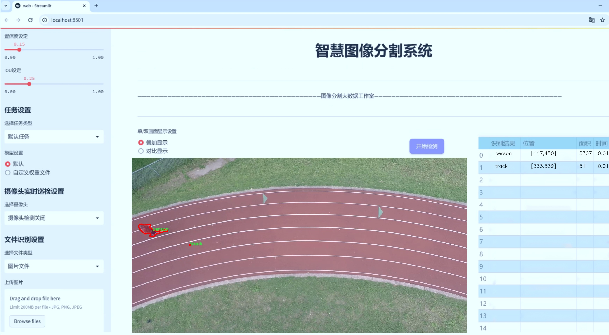
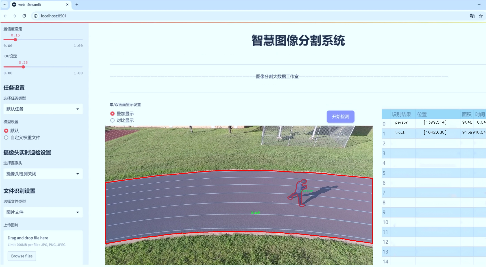
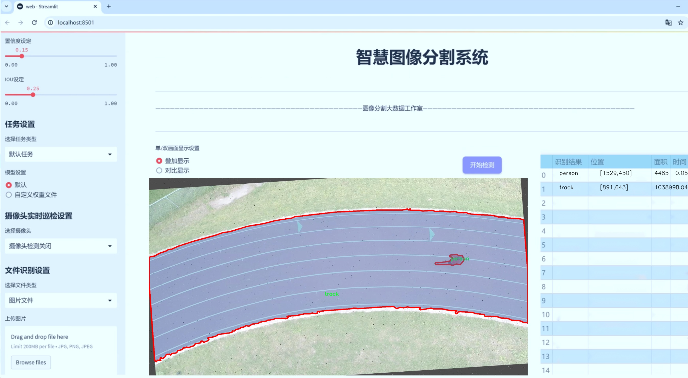
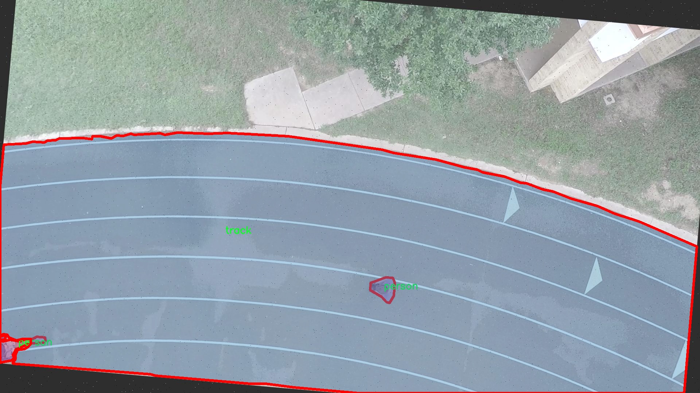
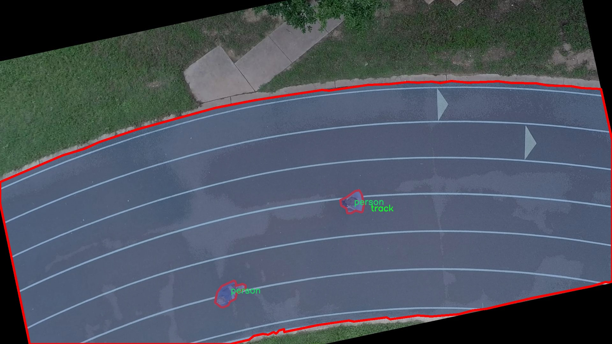
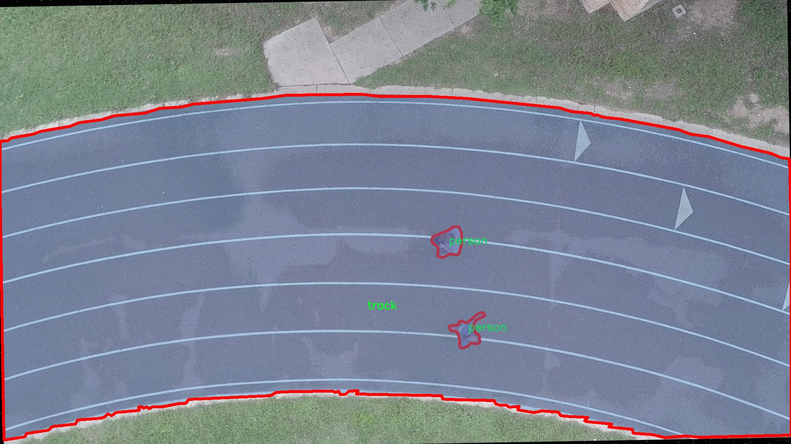
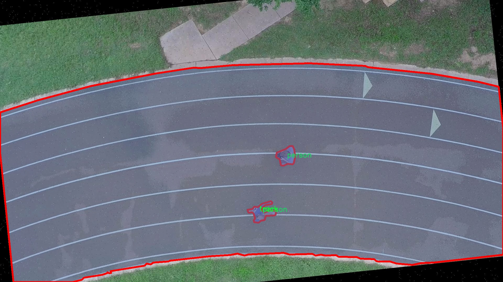
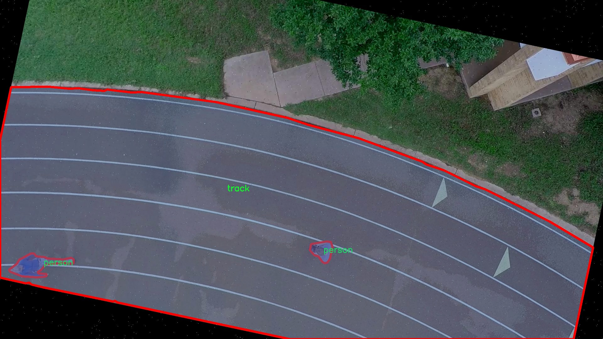

# 操场跑道轨道运动员图像分割系统： yolov8-seg-EfficientRepBiPAN

### 1.研究背景与意义

[参考博客](https://gitee.com/YOLOv8_YOLOv11_Segmentation_Studio/projects)

[博客来源](https://kdocs.cn/l/cszuIiCKVNis)

研究背景与意义

随着计算机视觉技术的快速发展，图像分割作为其中一个重要的研究方向，已经在多个领域得到了广泛应用，尤其是在体育领域。运动员的动作分析、赛事监控和训练效果评估等任务都离不开高效的图像分割技术。传统的图像处理方法在复杂场景下的表现往往不尽如人意，因此，基于深度学习的图像分割方法逐渐成为研究的热点。YOLO（You Only Look Once）系列模型因其高效的实时检测能力而受到广泛关注，尤其是YOLOv8的推出，进一步提升了目标检测和分割的精度与速度。

在体育赛事中，操场跑道是运动员进行训练和比赛的重要场所。通过对跑道上运动员的图像进行分割，可以实现对运动员动作的精准捕捉与分析，为教练员提供科学的训练指导。同时，运动员的安全监控、赛事的实时分析以及运动员的表现评估等任务也都依赖于高质量的图像分割技术。因此，基于改进YOLOv8的操场跑道轨道运动员图像分割系统的研究，具有重要的理论意义和实际应用价值。

本研究将使用FullTrackDataset数据集，该数据集包含1200张图像，涵盖了运动员和跑道两大类目标。这一数据集的构建不仅为模型的训练提供了丰富的样本，也为后续的模型评估和优化奠定了基础。通过对运动员和跑道的精确分割，可以实现对运动员在跑道上运动状态的全面分析，包括运动员的速度、姿态和运动轨迹等信息。这些数据对于提高运动员的训练效果、优化比赛策略以及提升赛事的观赏性具有重要意义。

此外，基于YOLOv8的改进方案，将在模型的特征提取、分割精度和实时性等方面进行深入研究。通过引入更为先进的网络结构和训练策略，期望能够显著提升模型在复杂场景下的表现。特别是在光照变化、运动模糊和背景干扰等挑战性条件下，改进后的YOLOv8模型能够更好地适应实际应用需求，为运动员的图像分割提供更为可靠的技术支持。

综上所述，基于改进YOLOv8的操场跑道轨道运动员图像分割系统的研究，不仅有助于推动图像分割技术在体育领域的应用，还将为运动员的训练和比赛提供科学依据，促进体育科技的发展。通过这一研究，期望能够为未来的智能体育系统奠定基础，推动体育赛事的智能化、数据化进程，为广大运动员和教练员提供更为高效的训练和管理工具。

### 2.图片演示







注意：本项目提供完整的训练源码数据集和训练教程,由于此博客编辑较早,暂不提供权重文件（best.pt）,需要按照6.训练教程进行训练后实现上图效果。

### 3.视频演示

[3.1 视频演示](https://www.bilibili.com/video/BV1Psm2YFEux/)

### 4.数据集信息

##### 4.1 数据集类别数＆类别名

nc: 2
names: ['person', 'track']


##### 4.2 数据集信息简介

数据集信息展示

在本研究中，我们采用了名为“FullTrackDataset”的数据集，以训练和改进YOLOv8-seg模型，旨在实现对操场跑道轨道上运动员的图像分割。该数据集专门设计用于运动场景的图像处理，包含丰富的标注信息，能够有效支持运动员与跑道的分割任务。数据集的类别数量为2，具体类别包括“person”（运动员）和“track”（跑道），这为模型的训练提供了清晰的目标和指导。

“FullTrackDataset”包含多样化的图像样本，涵盖了不同的运动员姿态、跑道条件以及光照变化等因素。这种多样性不仅提高了模型的泛化能力，还使其能够在各种实际应用场景中表现出色。数据集中运动员的图像被精确标注，确保每个运动员的轮廓与跑道的边界清晰可辨。通过这种方式，模型能够学习到运动员与跑道之间的特征差异，从而实现高效的图像分割。

在数据集的构建过程中，研究团队注重了图像的质量和标注的准确性。每张图像都经过严格筛选，确保其在不同的运动场景下具有代表性。此外，标注工作由经验丰富的专家完成，采用了高标准的标注工具，以确保每个类别的标注精确无误。这种严谨的工作流程为后续的模型训练奠定了坚实的基础。

数据集的设计不仅考虑了类别的多样性，还注重了数据的平衡性。运动员与跑道的比例经过精心调整，以避免模型在训练过程中出现偏倚现象。通过合理的样本分配，模型能够更好地学习到两类对象的特征，进而提高分割精度。

在训练过程中，YOLOv8-seg模型将利用“FullTrackDataset”中的图像数据进行特征提取和学习。模型通过卷积神经网络（CNN）架构，结合多层次的特征融合机制，能够有效捕捉到运动员与跑道之间的细微差别。这种先进的深度学习技术使得模型在处理复杂场景时，能够保持高效的分割性能。

此外，为了进一步提升模型的鲁棒性，研究团队还计划在训练过程中应用数据增强技术。这些技术包括随机裁剪、旋转、缩放以及颜色变换等，旨在增加训练样本的多样性，从而提高模型在不同环境下的适应能力。通过这些措施，模型将能够在实际应用中，准确识别和分割运动员与跑道的边界，为运动分析、智能监控等领域提供有力支持。

综上所述，“FullTrackDataset”作为本研究的核心数据集，不仅提供了丰富的标注信息和多样化的样本，还通过科学的设计和严谨的标注流程，为YOLOv8-seg模型的训练提供了坚实的基础。通过对该数据集的深入分析与应用，我们期待能够实现对操场跑道轨道运动员的高效图像分割，为相关领域的研究与应用开辟新的方向。











### 5.项目依赖环境部署教程（零基础手把手教学）

[5.1 环境部署教程链接（零基础手把手教学）](https://www.bilibili.com/video/BV1jG4Ve4E9t/?vd_source=bc9aec86d164b67a7004b996143742dc)


[5.2 安装Python虚拟环境创建和依赖库安装视频教程链接（零基础手把手教学）](https://www.bilibili.com/video/BV1nA4VeYEze/?vd_source=bc9aec86d164b67a7004b996143742dc)

### 6.手把手YOLOV8-seg训练视频教程（零基础手把手教学）

[6.1 手把手YOLOV8-seg训练视频教程（零基础小白有手就能学会）](https://www.bilibili.com/video/BV1cA4VeYETe/?vd_source=bc9aec86d164b67a7004b996143742dc)


按照上面的训练视频教程链接加载项目提供的数据集，运行train.py即可开始训练



     Epoch   gpu_mem       box       obj       cls    labels  img_size
     1/200     0G   0.01576   0.01955  0.007536        22      1280: 100%|██████████| 849/849 [14:42<00:00,  1.04s/it]
               Class     Images     Labels          P          R     mAP@.5 mAP@.5:.95: 100%|██████████| 213/213 [01:14<00:00,  2.87it/s]
                 all       3395      17314      0.994      0.957      0.0957      0.0843

     Epoch   gpu_mem       box       obj       cls    labels  img_size
     2/200     0G   0.01578   0.01923  0.007006        22      1280: 100%|██████████| 849/849 [14:44<00:00,  1.04s/it]
               Class     Images     Labels          P          R     mAP@.5 mAP@.5:.95: 100%|██████████| 213/213 [01:12<00:00,  2.95it/s]
                 all       3395      17314      0.996      0.956      0.0957      0.0845

     Epoch   gpu_mem       box       obj       cls    labels  img_size
     3/200     0G   0.01561    0.0191  0.006895        27      1280: 100%|██████████| 849/849 [10:56<00:00,  1.29it/s]
               Class     Images     Labels          P          R     mAP@.5 mAP@.5:.95: 100%|███████   | 187/213 [00:52<00:00,  4.04it/s]
                 all       3395      17314      0.996      0.957      0.0957      0.0845


### 7.50+种全套YOLOV8-seg创新点加载调参实验视频教程（一键加载写好的改进模型的配置文件）

[7.1 50+种全套YOLOV8-seg创新点加载调参实验视频教程（一键加载写好的改进模型的配置文件）](https://www.bilibili.com/video/BV1Hw4VePEXv/?vd_source=bc9aec86d164b67a7004b996143742dc)

### YOLOV8-seg算法简介

原始YOLOv8-seg算法原理

YOLOv8-seg算法是YOLO系列中最新的目标检测与分割模型，其设计理念是为了在复杂场景中实现高效且准确的目标识别与分割。该算法不仅延续了YOLO系列一贯的高效性，还在结构和功能上进行了诸多创新，以适应现代计算机视觉任务的需求。YOLOv8-seg的网络结构主要由三个部分组成：Backbone、Neck和Head，每个部分在整体性能中都扮演着至关重要的角色。

首先，Backbone部分是YOLOv8-seg的特征提取模块，采用了一系列卷积和反卷积层来捕捉输入图像中的重要特征。为了提升特征提取的效率和效果，YOLOv8-seg引入了C2模块作为基本构成单元。C2模块结合了残差连接和瓶颈结构，这不仅有效减小了网络的参数量，还提升了模型的表达能力。具体而言，Backbone部分由5个CBS模块、4个C2f模块和1个快速空间金字塔池化（SPPF）模块组成。CBS模块负责基本的卷积操作，而C2f模块则在YOLOv5的C3模块基础上进行了改进，增加了更多的残差连接，使得模型在轻量化的同时，能够获取更丰富的梯度信息。SPPF模块则通过空间金字塔池化技术，增强了模型对多尺度特征的捕捉能力。

接下来是Neck部分，主要负责多尺度特征的融合。YOLOv8-seg采用了PAN-FPN结构，通过将来自Backbone不同阶段的特征图进行融合，能够更好地捕捉不同尺度目标的信息。这种多尺度特征融合技术极大地提高了目标检测的性能和鲁棒性，使得模型在面对复杂背景和多样化目标时，依然能够保持较高的检测精度。Neck部分的设计理念是通过有效整合不同层次的特征，增强模型对小目标和大目标的适应能力。

最后，Head部分是YOLOv8-seg的预测端，负责最终的目标检测和分类任务。该部分设有三个检测头，分别用于处理不同尺寸的信息。通过将分类和检测头进行解耦，YOLOv8-seg能够更灵活地处理目标检测任务。此外，YOLOv8-seg在Head部分采用了Anchor-Free的设计理念，摒弃了传统的Anchor-Based方法，这一创新使得模型在处理目标时更加高效，减少了对先验框的依赖，从而提升了检测的准确性。

在训练过程中，YOLOv8-seg引入了动态Task-Aligned Assigner样本分配策略，以优化样本的选择和训练效率。此外，在数据增强方面，模型在最后10个epoch中关闭了马赛克增强，这一策略的实施旨在提高模型的泛化能力。损失计算方面，YOLOv8-seg使用了BCELoss作为分类损失，同时结合DFLLoss和CIoULoss作为回归损失，确保了模型在训练过程中的稳定性和收敛速度。

YOLOv8-seg的设计不仅关注模型的准确性和效率，还考虑到了实际应用中的多样性和复杂性。通过引入更为先进的模块和结构，YOLOv8-seg在处理目标检测与分割任务时，展现出了卓越的性能。这一算法的成功实现，不仅为计算机视觉领域带来了新的技术突破，也为未来的研究与应用提供了更为广阔的空间。

总的来说，YOLOv8-seg算法在Backbone、Neck和Head三个核心部分的设计上，充分体现了现代深度学习技术的先进性与灵活性。通过对网络结构的不断优化与创新，YOLOv8-seg在目标检测与分割任务中实现了更高的效率和准确性，为实际应用提供了强有力的支持。随着计算机视觉技术的不断发展，YOLOv8-seg无疑将在各类应用场景中发挥重要作用，推动智能视觉系统的进一步进化。


### 9.系统功能展示（检测对象为举例，实际内容以本项目数据集为准）

图9.1.系统支持检测结果表格显示

  图9.2.系统支持置信度和IOU阈值手动调节

  图9.3.系统支持自定义加载权重文件best.pt(需要你通过步骤5中训练获得)

  图9.4.系统支持摄像头实时识别

  图9.5.系统支持图片识别

  图9.6.系统支持视频识别

  图9.7.系统支持识别结果文件自动保存

  图9.8.系统支持Excel导出检测结果数据


### 10.50+种全套YOLOV8-seg创新点原理讲解（非科班也可以轻松写刊发刊，V11版本正在科研待更新）

#### 10.1 由于篇幅限制，每个创新点的具体原理讲解就不一一展开，具体见下列网址中的创新点对应子项目的技术原理博客网址【Blog】：


[10.1 50+种全套YOLOV8-seg创新点原理讲解链接](https://gitee.com/qunmasj/good)

#### 10.2 部分改进模块原理讲解(完整的改进原理见上图和技术博客链接)【如果此小节的图加载失败可以通过CSDN或者Github搜索该博客的标题访问原始博客，原始博客图片显示正常】
### 全维动态卷积ODConv
鉴于上述讨论，我们的ODConv引入了一种多维注意机制，该机制具有并行策略，用于学习卷积核在核空间的所有四个维度上的不同注意。图提供了CondConv、DyConv和ODConv的示意性比较。

ODConv的公式：根据等式1中的符号，ODConv可定义为


 将注意力标量分配给整个卷积核。图2示出了将这四种类型的关注乘以n个卷积核的过程。原则上，这四种类型的关注是相互补充的，并且以位置、信道、滤波器和核的顺序将它们逐步乘以卷积核 
 ，使得卷积运算不同w.r.t.所有空间位置、所有输入信道、所有滤波器和输入x的所有核，提供捕获丰富上下文线索的性能保证。因此，ODConv可以显著增强CNN基本卷积运算的特征提取能力。此外，具有单个卷积核的ODConv可以与标准CondConv和DyConv竞争或优于它们，为最终模型引入的额外参数大大减少。提供了大量实验来验证这些优点。通过比较等式1和等式2，我们可以清楚地看到，ODConv是一种更广义的动态卷积。此外，当设置n=1且 所有分量均为1时，只关注滤波器方向 的ODConv将减少为：将基于输入特征的SE变量应用于卷积滤波器，然后进行卷积运算（注意原始SE（Hu等人，2018b）基于输出特征，并且用于重新校准输出特征本身）。这种SE变体是ODConv的特例。


图：将ODConv中的四种注意类型逐步乘以卷积核的示例。（a） 沿空间维度的逐位置乘法运算，（b）沿输入信道维度的逐信道乘法运算、（c）沿输出信道维度的按滤波器乘法运算，以及（d）沿卷积核空间的核维度的按核乘法运算。方法部分对符号进行了说明
实现：对于ODConv，一个关键问题是如何计算卷积核的四种关注度 。继CondConv和DyConv之后，我们还使用SE型注意力模块（Hu等人，2018b），但将多个头部作为来计算它们，其结构如图所示。具体而言，首先通过逐通道全局平均池（GAP）运算将输入压缩到具有长度的特征向量中。随后，存在完全连接（FC）层和四个头部分支。ReLU（Krizhevsky等人，2012）位于FC层之后。FC层将压缩特征向量映射到具有缩减比的低维空间（根据消融实验，我们在所有主要实验中设置 ，避免了高模型复杂度）。对于四个头部分支，每个分支都有一个输出大小如图。

### 引入ODConv的改进YOLO
参考这篇博客涵盖了引入ODConv的改进YOLOv8系统的内容，ODConv采用多维注意机制，在卷积核空间的四个维度上学习不同的注意。结合了CondConv和DyConv的优势，ODConv通过图示的四种注意类型逐步与卷积核相乘，以捕获丰富的上下文线索，提升特征提取能力。

#### ODConv结构与方法
ODConv的公式和图示展示了其关注力分配给卷积核的方式，其中四种类型的关注以位置、信道、滤波器和核的顺序逐步与卷积核相乘。这种结构保证了卷积运算不同于标准的Conv操作，能够捕获更多上下文信息，从而增强了CNN的特征提取能力。另外，单个卷积核的ODConv在性能上能够与CondConv和DyConv相竞争，并且引入的额外参数大幅减少。

ODConv的特殊之处在于其广义的动态卷积性质，同时在特定条件下（n=1且所有分量为1），它可以退化为一种特例，即只关注滤波器方向，这类似于基于输入特征的SE变体，但不同于原始SE，它基于输出特征。

#### ODConv的实现
关键问题在于如何计算卷积核的四种关注度。ODConv采用了SE型注意力模块，结合了多个头部来计算这些关注度。具体实现上，通过逐通道全局平均池运算和完全连接层，将输入压缩为特征向量，随后使用四个头部分支来计算四种不同类型的关注。这样的结构能在保持模型复杂度可控的情况下，提升了特征的表征能力。

ODConv的引入为YOLOv8带来了显著的性能提升，并且通过大量实验证明了其在特征提取方面的优越性。其结合了多维注意机制和卷积操作，为目标检测和分拣系统的提升带来了新的思路和性能突破。


### 11.项目核心源码讲解（再也不用担心看不懂代码逻辑）

#### 11.1 ultralytics\utils\errors.py

以下是经过精简和详细注释的核心代码部分：

```python
# 导入所需的工具函数
from ultralytics.utils import emojis

class HUBModelError(Exception):
    """
    自定义异常类，用于处理与Ultralytics YOLO模型获取相关的错误。

    当请求的模型未找到或无法检索时，将引发此异常。
    异常消息经过处理，以包含表情符号，提升用户体验。

    属性:
        message (str): 当异常被引发时显示的错误消息。
    """

    def __init__(self, message='Model not found. Please check model URL and try again.'):
        """初始化异常，默认消息为模型未找到的提示信息。"""
        # 调用父类的构造函数，并将处理过的消息传递给它
        super().__init__(emojis(message))  # 使用emojis函数处理消息，以便添加表情符号
```

### 代码说明：
1. **导入模块**：从`ultralytics.utils`导入`emojis`函数，用于在异常消息中添加表情符号。
2. **HUBModelError类**：继承自Python内置的`Exception`类，定义了一个自定义异常，用于处理与模型获取相关的错误。
3. **构造函数**：
   - 接受一个可选的`message`参数，默认值为“模型未找到，请检查模型URL并重试”。
   - 调用父类的构造函数，并使用`emojis`函数处理消息，以便在消息中添加表情符号，增强用户体验。

这个文件定义了一个自定义异常类 `HUBModelError`，用于处理与 Ultralytics YOLO 模型获取相关的错误。该异常主要在请求的模型未找到或无法检索时被触发。类的文档字符串详细说明了该异常的用途和属性。

在 `HUBModelError` 类中，构造函数 `__init__` 接受一个可选的消息参数，默认值为“Model not found. Please check model URL and try again.”，这意味着如果没有提供具体的错误消息，系统会使用这个默认消息。构造函数调用了父类 `Exception` 的构造函数，并通过 `emojis` 函数处理消息，以增强用户体验，使错误信息更加生动和友好。

总的来说，这个文件的主要功能是提供一个专门用于处理模型获取错误的异常类，并通过使用表情符号来改善错误消息的可读性和用户体验。

#### 11.2 ultralytics\models\sam\__init__.py

以下是代码中最核心的部分，并附上详细的中文注释：

```python
# 导入所需的模块
from .model import SAM  # 从当前包的model模块中导入SAM类
from .predict import Predictor  # 从当前包的predict模块中导入Predictor类

# 定义模块的公开接口
__all__ = 'SAM', 'Predictor'  # 这表示当使用from module import *时，只会导入SAM和Predictor
```

### 注释说明：
1. `from .model import SAM`：这一行代码从当前包的`model`模块中导入了`SAM`类，`SAM`可能是一个与模型相关的类，用于构建或处理特定的模型。
  
2. `from .predict import Predictor`：这一行代码从当前包的`predict`模块中导入了`Predictor`类，`Predictor`可能是一个用于进行预测的类，负责处理输入数据并生成输出结果。

3. `__all__ = 'SAM', 'Predictor'`：这一行定义了模块的公开接口，指定了当使用`from module import *`时，只有`SAM`和`Predictor`这两个类会被导入。这是一种控制模块导出内容的方式，有助于避免不必要的命名冲突和隐藏内部实现细节。

这个程序文件是Ultralytics YOLO项目中的一个模块初始化文件，位于`ultralytics/models/sam`目录下。文件的主要功能是导入该模块中定义的类和函数，并将它们暴露给外部使用。

首先，文件开头的注释部分提到这是Ultralytics YOLO项目的一部分，并且该项目遵循AGPL-3.0许可证。这意味着该项目是开源的，用户可以自由使用、修改和分发，但必须遵循相应的许可证条款。

接下来，文件通过`from .model import SAM`语句导入了`model`模块中的`SAM`类。这表明`SAM`是该模块的一个重要组成部分，可能是一个用于处理特定任务的模型或算法。

紧接着，文件又通过`from .predict import Predictor`语句导入了`predict`模块中的`Predictor`类。这说明`Predictor`类也是该模块的重要功能之一，可能用于进行预测或推断操作。

最后，`__all__`变量被定义为一个元组，包含了`'SAM'`和`'Predictor'`。这个变量的作用是指定当使用`from module import *`语句时，哪些名称会被导入。这是一种控制模块接口的方式，确保用户只访问到模块中指定的部分，而不是所有内容。

总体来说，这个初始化文件的主要作用是组织和管理模块中的类，使得用户能够方便地使用`SAM`和`Predictor`这两个重要的组件。

#### 11.3 ultralytics\hub\auth.py

以下是代码中最核心的部分，并附上详细的中文注释：

```python
import requests

class Auth:
    """
    处理身份验证过程，包括API密钥处理、基于cookie的身份验证和头部生成。

    支持的身份验证方法：
    1. 直接使用API密钥。
    2. 使用浏览器cookie进行身份验证（特别是在Google Colab中）。
    3. 提示用户输入API密钥。
    """
    id_token = api_key = model_key = False  # 初始化身份验证相关的属性

    def __init__(self, api_key='', verbose=False):
        """
        初始化Auth类，接受一个可选的API密钥。

        参数：
            api_key (str, optional): API密钥或组合的API密钥和模型ID
        """
        # 如果API密钥包含模型ID，则只保留API密钥部分
        api_key = api_key.split('_')[0]

        # 设置API密钥属性，如果没有提供则使用设置中的API密钥
        self.api_key = api_key or SETTINGS.get('api_key', '')

        # 如果提供了API密钥
        if self.api_key:
            # 检查提供的API密钥是否与设置中的API密钥匹配
            if self.api_key == SETTINGS.get('api_key'):
                if verbose:
                    LOGGER.info(f'已认证 ✅')
                return
            else:
                # 尝试使用提供的API密钥进行身份验证
                success = self.authenticate()
        # 如果没有提供API密钥并且环境是Google Colab
        elif is_colab():
            # 尝试使用浏览器cookie进行身份验证
            success = self.auth_with_cookies()
        else:
            # 请求用户输入API密钥
            success = self.request_api_key()

        # 如果身份验证成功，更新设置中的API密钥
        if success:
            SETTINGS.update({'api_key': self.api_key})
            if verbose:
                LOGGER.info(f'新认证成功 ✅')
        elif verbose:
            LOGGER.info(f'从 {API_KEY_URL} 获取API密钥')

    def authenticate(self) -> bool:
        """
        尝试使用id_token或API密钥进行服务器身份验证。

        返回：
            bool: 如果身份验证成功则返回True，否则返回False。
        """
        try:
            header = self.get_auth_header()  # 获取身份验证头
            if header:
                r = requests.post(f'{HUB_API_ROOT}/v1/auth', headers=header)  # 发送身份验证请求
                if not r.json().get('success', False):
                    raise ConnectionError('无法进行身份验证。')
                return True
            raise ConnectionError('用户尚未在本地进行身份验证。')
        except ConnectionError:
            self.id_token = self.api_key = False  # 重置无效的身份验证信息
            LOGGER.warning('无效的API密钥 ⚠️')
            return False

    def auth_with_cookies(self) -> bool:
        """
        尝试通过cookie获取身份验证并设置id_token。用户必须已登录HUB并在支持的浏览器中运行。

        返回：
            bool: 如果身份验证成功则返回True，否则返回False。
        """
        if not is_colab():
            return False  # 目前仅在Colab中有效
        try:
            authn = request_with_credentials(f'{HUB_API_ROOT}/v1/auth/auto')  # 请求自动身份验证
            if authn.get('success', False):
                self.id_token = authn.get('data', {}).get('idToken', None)  # 设置id_token
                self.authenticate()  # 进行身份验证
                return True
            raise ConnectionError('无法获取浏览器身份验证详细信息。')
        except ConnectionError:
            self.id_token = False  # 重置无效的id_token
            return False

    def get_auth_header(self):
        """
        获取用于进行API请求的身份验证头。

        返回：
            (dict): 如果设置了id_token或API密钥，则返回身份验证头，否则返回None。
        """
        if self.id_token:
            return {'authorization': f'Bearer {self.id_token}'}
        elif self.api_key:
            return {'x-api-key': self.api_key}
        return None  # 如果没有身份验证信息，返回None
```

### 代码说明：
1. **Auth类**：负责处理身份验证，包括API密钥和cookie的管理。
2. **初始化方法**：根据提供的API密钥或环境（如Google Colab）进行身份验证。
3. **authenticate方法**：通过API密钥或id_token向服务器发送身份验证请求。
4. **auth_with_cookies方法**：在Google Colab中使用浏览器cookie进行身份验证。
5. **get_auth_header方法**：生成用于API请求的身份验证头。

这个程序文件是用于管理Ultralytics YOLO的身份验证过程，主要涉及API密钥的处理、基于cookie的身份验证以及请求头的生成。该类支持多种身份验证方法，包括直接使用API密钥、使用浏览器cookie进行身份验证（特别是在Google Colab环境中），以及提示用户输入API密钥。

在类的属性中，`id_token`、`api_key`和`model_key`都初始化为False，分别用于身份验证、API密钥和模型密钥。构造函数接受一个可选的API密钥参数，并根据输入的API密钥进行初始化。如果提供了API密钥，程序会检查该密钥是否与设置中的密钥匹配。如果匹配，程序会记录用户已登录的信息；如果不匹配，则尝试进行身份验证。如果没有提供API密钥且当前环境为Google Colab，程序会尝试使用浏览器cookie进行身份验证；否则，程序会请求用户输入API密钥。

`request_api_key`方法会提示用户输入API密钥，最多尝试三次。如果用户输入的密钥能够成功进行身份验证，方法返回True；否则，抛出连接错误。`authenticate`方法尝试使用`id_token`或API密钥与服务器进行身份验证，并返回是否成功的布尔值。如果身份验证失败，程序会重置无效的密钥并记录警告信息。

`auth_with_cookies`方法尝试通过cookie获取身份验证信息，并设置`id_token`。该方法仅在Google Colab环境中有效。如果成功获取身份验证信息，程序会调用`authenticate`方法进行进一步验证。

最后，`get_auth_header`方法用于生成API请求的身份验证头。如果`id_token`或`api_key`已设置，返回相应的请求头；否则返回None。这个文件的设计使得用户在使用Ultralytics YOLO时能够方便地进行身份验证，确保能够安全地访问API。

#### 11.4 ultralytics\models\fastsam\model.py

```python
# 引入必要的库
from pathlib import Path
from ultralytics.engine.model import Model
from .predict import FastSAMPredictor
from .val import FastSAMValidator

class FastSAM(Model):
    """
    FastSAM模型接口。

    示例：
        ```python
        from ultralytics import FastSAM

        model = FastSAM('last.pt')  # 加载模型
        results = model.predict('ultralytics/assets/bus.jpg')  # 进行预测
        ```
    """

    def __init__(self, model='FastSAM-x.pt'):
        """初始化FastSAM类，调用父类（YOLO）的__init__方法，并设置默认模型。"""
        # 如果传入的模型名称是'FastSAM.pt'，则将其替换为'FastSAM-x.pt'
        if str(model) == 'FastSAM.pt':
            model = 'FastSAM-x.pt'
        # 确保传入的模型文件后缀不是.yaml或.yml，FastSAM模型只支持预训练模型
        assert Path(model).suffix not in ('.yaml', '.yml'), 'FastSAM models only support pre-trained models.'
        # 调用父类的初始化方法，设置模型和任务类型为'segment'
        super().__init__(model=model, task='segment')

    @property
    def task_map(self):
        """返回一个字典，将分割任务映射到相应的预测器和验证器类。"""
        return {'segment': {'predictor': FastSAMPredictor, 'validator': FastSAMValidator}}
```

### 代码核心部分及注释说明：

1. **类定义**：
   - `class FastSAM(Model):`：定义一个名为`FastSAM`的类，继承自`Model`类，表示这是一个FastSAM模型的接口。

2. **初始化方法**：
   - `def __init__(self, model='FastSAM-x.pt'):`：构造函数，初始化FastSAM模型。
   - `if str(model) == 'FastSAM.pt': model = 'FastSAM-x.pt'`：如果用户传入的模型名称是`FastSAM.pt`，则将其替换为`FastSAM-x.pt`，确保使用的是正确的模型。
   - `assert Path(model).suffix not in ('.yaml', '.yml'), 'FastSAM models only support pre-trained models.'`：检查模型文件的后缀，确保不使用`.yaml`或`.yml`格式的文件，因为FastSAM只支持预训练模型。
   - `super().__init__(model=model, task='segment')`：调用父类的初始化方法，传入模型路径和任务类型（此处为分割任务）。

3. **任务映射属性**：
   - `@property def task_map(self):`：定义一个属性`task_map`，用于返回分割任务对应的预测器和验证器类。
   - `return {'segment': {'predictor': FastSAMPredictor, 'validator': FastSAMValidator}}`：返回一个字典，映射分割任务到`FastSAMPredictor`和`FastSAMValidator`类。

这个程序文件定义了一个名为 `FastSAM` 的类，它是一个用于图像分割的模型接口，继承自 `Model` 类。文件的开头部分包含了一些版权信息和必要的模块导入。

在 `FastSAM` 类的文档字符串中，提供了一个简单的使用示例，展示了如何实例化 `FastSAM` 模型并对一张图片进行预测。用户可以通过传入模型文件的路径来创建 `FastSAM` 实例，并使用 `predict` 方法进行图像处理。

构造函数 `__init__` 中，首先检查传入的模型名称，如果模型名称是 `'FastSAM.pt'`，则将其更改为 `'FastSAM-x.pt'`。接着，使用 `assert` 语句确保传入的模型文件后缀不是 `.yaml` 或 `.yml`，因为 `FastSAM` 模型只支持预训练模型。最后，调用父类的构造函数，传入模型路径和任务类型（这里是 'segment'）。

`task_map` 属性返回一个字典，映射了分割任务到相应的预测器和验证器类。这意味着在执行分割任务时，可以根据这个映射来选择合适的类进行预测和验证。

总体来说，这个文件提供了一个结构化的方式来使用 `FastSAM` 模型进行图像分割任务，封装了模型的初始化和任务映射的逻辑，使得用户可以方便地进行模型的加载和使用。

#### 11.5 ultralytics\nn\extra_modules\ops_dcnv3\setup.py

以下是经过简化并添加详细中文注释的核心代码部分：

```python
# 导入必要的库
import os
import glob
import torch
from torch.utils.cpp_extension import CUDA_HOME, CppExtension, CUDAExtension
from setuptools import find_packages, setup

# 定义依赖包
requirements = ["torch", "torchvision"]

def get_extensions():
    # 获取当前文件目录
    this_dir = os.path.dirname(os.path.abspath(__file__))
    # 定义扩展模块的源代码目录
    extensions_dir = os.path.join(this_dir, "src")

    # 获取主文件和CPU、CUDA源文件
    main_file = glob.glob(os.path.join(extensions_dir, "*.cpp"))
    source_cpu = glob.glob(os.path.join(extensions_dir, "cpu", "*.cpp"))
    source_cuda = glob.glob(os.path.join(extensions_dir, "cuda", "*.cu"))

    # 合并源文件
    sources = main_file + source_cpu
    extension = CppExtension  # 默认使用 CppExtension
    extra_compile_args = {"cxx": []}  # 编译参数
    define_macros = []  # 宏定义

    # 检查CUDA是否可用
    if torch.cuda.is_available() and CUDA_HOME is not None:
        extension = CUDAExtension  # 使用 CUDAExtension
        sources += source_cuda  # 添加CUDA源文件
        define_macros += [("WITH_CUDA", None)]  # 定义宏
        extra_compile_args["nvcc"] = []  # CUDA编译参数
    else:
        raise NotImplementedError('Cuda is not available')  # 抛出异常

    # 生成完整的源文件路径
    sources = [os.path.join(extensions_dir, s) for s in sources]
    include_dirs = [extensions_dir]  # 包含目录

    # 创建扩展模块
    ext_modules = [
        extension(
            "DCNv3",  # 模块名称
            sources,  # 源文件
            include_dirs=include_dirs,  # 包含目录
            define_macros=define_macros,  # 宏定义
            extra_compile_args=extra_compile_args,  # 编译参数
        )
    ]
    return ext_modules  # 返回扩展模块列表

# 设置包信息
setup(
    name="DCNv3",  # 包名称
    version="1.1",  # 版本号
    author="InternImage",  # 作者
    url="https://github.com/OpenGVLab/InternImage",  # 项目网址
    description="PyTorch Wrapper for CUDA Functions of DCNv3",  # 描述
    packages=find_packages(exclude=("configs", "tests")),  # 查找包
    ext_modules=get_extensions(),  # 获取扩展模块
    cmdclass={"build_ext": torch.utils.cpp_extension.BuildExtension},  # 自定义构建命令
)
```

### 代码说明：
1. **导入库**：导入了必要的库，包括操作系统相关的库、PyTorch和setuptools等。
2. **获取扩展函数**：`get_extensions` 函数用于查找并返回需要编译的扩展模块，包括CPU和CUDA的源文件。
3. **CUDA支持检查**：检查CUDA是否可用，并根据情况选择相应的扩展类型（`CppExtension` 或 `CUDAExtension`）。
4. **构建扩展模块**：通过`setup`函数设置包的基本信息，并指定扩展模块的构建过程。

这个程序文件是一个Python的`setup.py`脚本，主要用于构建和安装一个名为“DCNv3”的PyTorch扩展模块。该模块实现了DCNv3（Deformable Convolutional Networks v3）的CUDA功能。文件开头包含了一些版权信息和许可证声明，表明该代码是由OpenGVLab开发并以MIT许可证发布的。

首先，脚本导入了一些必要的库，包括`os`和`glob`用于文件和目录操作，`torch`用于PyTorch相关功能，以及`setuptools`中的一些函数用于打包和安装。`requirements`列表定义了该模块的依赖项，包括`torch`和`torchvision`。

接下来，定义了一个名为`get_extensions`的函数，该函数用于获取需要编译的扩展模块。函数内部首先获取当前文件的目录，并构建源代码文件的路径。通过`glob`模块，脚本查找指定目录下的C++源文件（`.cpp`）和CUDA源文件（`.cu`）。

在确定源文件后，脚本根据CUDA的可用性选择使用`CppExtension`或`CUDAExtension`。如果CUDA可用，则将CUDA源文件添加到源列表中，并定义宏`WITH_CUDA`。如果CUDA不可用，脚本会抛出一个`NotImplementedError`，提示用户CUDA不可用。

然后，脚本将所有源文件的路径添加到`sources`列表中，并指定包含目录。接着，创建一个扩展模块的列表，包含了模块的名称、源文件、包含目录、宏定义和编译参数。

最后，调用`setup`函数来配置模块的安装信息，包括模块名称、版本、作者、项目网址、描述、需要排除的包（如`configs`和`tests`），以及通过`get_extensions`函数获取的扩展模块列表。`cmdclass`参数指定了构建扩展时使用的命令类。

总体来说，这个`setup.py`文件的主要功能是为DCNv3模块的编译和安装提供必要的配置和指令，使得用户能够在其环境中方便地使用该模块。

### 12.系统整体结构（节选）

### 整体功能和构架概括

Ultralytics YOLO项目是一个用于目标检测和图像分割的深度学习框架，包含多个模块和工具，以支持不同的模型和功能。该项目的架构清晰，分为多个子模块，每个模块负责特定的功能。整体上，项目通过提供自定义异常处理、模型接口、身份验证机制和扩展模块的构建，确保用户能够方便地使用和扩展YOLO模型。

- **异常处理**：通过`errors.py`文件定义了自定义异常类，处理模型获取过程中的错误。
- **模型接口**：`sam/__init__.py`和`fastsam/model.py`文件定义了模型的初始化和预测功能，提供了用户友好的接口来加载和使用模型。
- **身份验证**：`hub/auth.py`文件管理API密钥和身份验证过程，确保用户能够安全地访问API。
- **扩展模块构建**：`setup.py`文件用于构建和安装DCNv3扩展模块，提供了必要的编译和安装配置。

### 文件功能整理表

| 文件路径                                          | 功能描述                                                                                     |
|--------------------------------------------------|----------------------------------------------------------------------------------------------|
| `ultralytics/utils/errors.py`                   | 定义自定义异常类 `HUBModelError`，用于处理模型获取过程中的错误，提供友好的错误消息。      |
| `ultralytics/models/sam/__init__.py`            | 导入并暴露 `SAM` 和 `Predictor` 类，作为图像分割模型的接口，方便用户使用。                |
| `ultralytics/hub/auth.py`                       | 管理API密钥和身份验证过程，支持多种身份验证方式，确保用户安全访问API。                    |
| `ultralytics/models/fastsam/model.py`           | 定义 `FastSAM` 类，提供图像分割模型的接口，封装模型的初始化和任务映射逻辑。              |
| `ultralytics/nn/extra_modules/ops_dcnv3/setup.py` | 提供DCNv3模块的构建和安装配置，支持CUDA扩展的编译，确保用户能够在其环境中使用该模块。    |

这个表格清晰地总结了每个文件的主要功能，帮助理解Ultralytics YOLO项目的整体架构和各个模块的职责。

### 13.图片、视频、摄像头图像分割Demo(去除WebUI)代码

在这个博客小节中，我们将讨论如何在不使用WebUI的情况下，实现图像分割模型的使用。本项目代码已经优化整合，方便用户将分割功能嵌入自己的项目中。
核心功能包括图片、视频、摄像头图像的分割，ROI区域的轮廓提取、类别分类、周长计算、面积计算、圆度计算以及颜色提取等。
这些功能提供了良好的二次开发基础。

### 核心代码解读

以下是主要代码片段，我们会为每一块代码进行详细的批注解释：

```python
import random
import cv2
import numpy as np
from PIL import ImageFont, ImageDraw, Image
from hashlib import md5
from model import Web_Detector
from chinese_name_list import Label_list

# 根据名称生成颜色
def generate_color_based_on_name(name):
    ......

# 计算多边形面积
def calculate_polygon_area(points):
    return cv2.contourArea(points.astype(np.float32))

...
# 绘制中文标签
def draw_with_chinese(image, text, position, font_size=20, color=(255, 0, 0)):
    image_pil = Image.fromarray(cv2.cvtColor(image, cv2.COLOR_BGR2RGB))
    draw = ImageDraw.Draw(image_pil)
    font = ImageFont.truetype("simsun.ttc", font_size, encoding="unic")
    draw.text(position, text, font=font, fill=color)
    return cv2.cvtColor(np.array(image_pil), cv2.COLOR_RGB2BGR)

# 动态调整参数
def adjust_parameter(image_size, base_size=1000):
    max_size = max(image_size)
    return max_size / base_size

# 绘制检测结果
def draw_detections(image, info, alpha=0.2):
    name, bbox, conf, cls_id, mask = info['class_name'], info['bbox'], info['score'], info['class_id'], info['mask']
    adjust_param = adjust_parameter(image.shape[:2])
    spacing = int(20 * adjust_param)

    if mask is None:
        x1, y1, x2, y2 = bbox
        aim_frame_area = (x2 - x1) * (y2 - y1)
        cv2.rectangle(image, (x1, y1), (x2, y2), color=(0, 0, 255), thickness=int(3 * adjust_param))
        image = draw_with_chinese(image, name, (x1, y1 - int(30 * adjust_param)), font_size=int(35 * adjust_param))
        y_offset = int(50 * adjust_param)  # 类别名称上方绘制，其下方留出空间
    else:
        mask_points = np.concatenate(mask)
        aim_frame_area = calculate_polygon_area(mask_points)
        mask_color = generate_color_based_on_name(name)
        try:
            overlay = image.copy()
            cv2.fillPoly(overlay, [mask_points.astype(np.int32)], mask_color)
            image = cv2.addWeighted(overlay, 0.3, image, 0.7, 0)
            cv2.drawContours(image, [mask_points.astype(np.int32)], -1, (0, 0, 255), thickness=int(8 * adjust_param))

            # 计算面积、周长、圆度
            area = cv2.contourArea(mask_points.astype(np.int32))
            perimeter = cv2.arcLength(mask_points.astype(np.int32), True)
            ......

            # 计算色彩
            mask = np.zeros(image.shape[:2], dtype=np.uint8)
            cv2.drawContours(mask, [mask_points.astype(np.int32)], -1, 255, -1)
            color_points = cv2.findNonZero(mask)
            ......

            # 绘制类别名称
            x, y = np.min(mask_points, axis=0).astype(int)
            image = draw_with_chinese(image, name, (x, y - int(30 * adjust_param)), font_size=int(35 * adjust_param))
            y_offset = int(50 * adjust_param)

            # 绘制面积、周长、圆度和色彩值
            metrics = [("Area", area), ("Perimeter", perimeter), ("Circularity", circularity), ("Color", color_str)]
            for idx, (metric_name, metric_value) in enumerate(metrics):
                ......

    return image, aim_frame_area

# 处理每帧图像
def process_frame(model, image):
    pre_img = model.preprocess(image)
    pred = model.predict(pre_img)
    det = pred[0] if det is not None and len(det)
    if det:
        det_info = model.postprocess(pred)
        for info in det_info:
            image, _ = draw_detections(image, info)
    return image

if __name__ == "__main__":
    cls_name = Label_list
    model = Web_Detector()
    model.load_model("./weights/yolov8s-seg.pt")

    # 摄像头实时处理
    cap = cv2.VideoCapture(0)
    while cap.isOpened():
        ret, frame = cap.read()
        if not ret:
            break
        ......

    # 图片处理
    image_path = './icon/OIP.jpg'
    image = cv2.imread(image_path)
    if image is not None:
        processed_image = process_frame(model, image)
        ......

    # 视频处理
    video_path = ''  # 输入视频的路径
    cap = cv2.VideoCapture(video_path)
    while cap.isOpened():
        ret, frame = cap.read()
        ......
```


### 14.完整训练+Web前端界面+50+种创新点源码、数据集获取


# [下载链接：https://mbd.pub/o/bread/Z5WamZtt](https://mbd.pub/o/bread/Z5WamZtt)